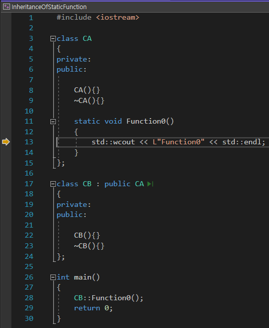

# Test-InheritanceOfStaticFunction

# Table of contents

1. [Purpose](#1-purpose)  
2. [About inheritance](#2-about-inheritance)  
3. [Result](#3-result)  

## 1. Purpose

- To test inheritance of static function.

## 2. About inheritance

## 3. Result

